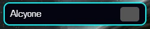

# SC2 Map Veto

Map veto system for Starcraft II where you can also set you map order. Perfect addition when doing tounament or showing you viewers on livestream what map is being vetoed and what map order the series is.

**Version: 1.0.3**

## Visual

## Controller

## Features
- Custom map veto system
- Best-of system (BO2, BO3, BO5, BO7, BO9)
- Map Order indicators 
- Map preview with file upload

## Table of Contents
1. [Installation](#installation)
2. [Usage](#usage)
3. [Bugs & Support](#bugs-and-support)
4. [License](#license)
5. [Contact](#contact)

## Installation
No installation needed

### Prerequisites
- Web browser  
or
- Livestreaming software (ex. OBS)

### Instructions
1. For **Web browser**
    1. Open index.html in your favorite browser
2. For **OBS**
    1. Make a 'Browser' source
    > **Note**
    >[OBS](https://obsproject.com/kb/sources-guide)
    >[Streamlabs](https://streamlabs.com/content-hub/post/introducing-browser-source-interaction-for-streamlabs-desktop)
    2. For Browser properties:
        1. Check "Local File" checkbox
        2. Press Browse and load up index.html in the folder.
        3. Change the 'Height' to 1000
        4. Press 'OK'
    3. For interaction press the 'Interact' button or find it by right click on the browser source

## Usage
### How to Use
1. Press the map in the map pool to veto map
2. Hover over the maps to se a preview of the map
3. Game Settings
    1.  Set the 'Best of' settings to be able to set map order
    2.  When 'Best of' is set to between bo2 - bo9, hover on the right side of the map in map pool with mouse to be able to click to set order: 1. - 9. 
    
    3.  Press Reset All to reset the veto and map order
4. Map Settings
    1.  Press 'Show' to show more settings
    2.  To edit map name first select what map you want to edit
    3.  Enter new name in the text field.
    4.  Press the 'Change Map Preview' To change the map image
    5.  Check the 'Hide Map Preview' to hide the map image.
    > **Note**
    >
    > These settings won't save for next time running this program.

## Bugs and Support
Connect with me on Discord in the [#overlay](https://discord.com/channels/801938615730307092/1295352407177564241) channel.

## License
This project is licensed under the terms of the MIT license.

## Contact
Mattias (Zystem) Viklund  
Email: mattiasviklund.production@gmail.com 
